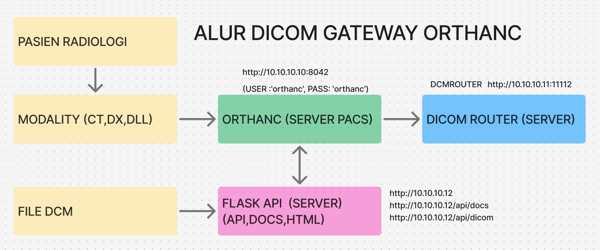
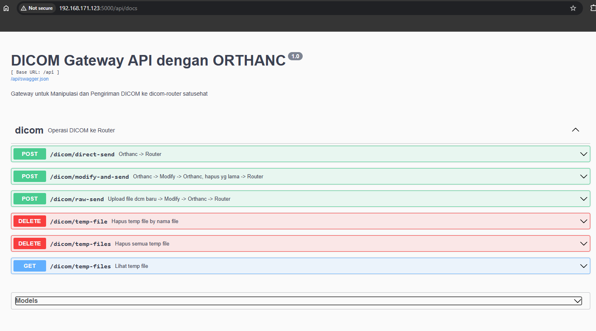
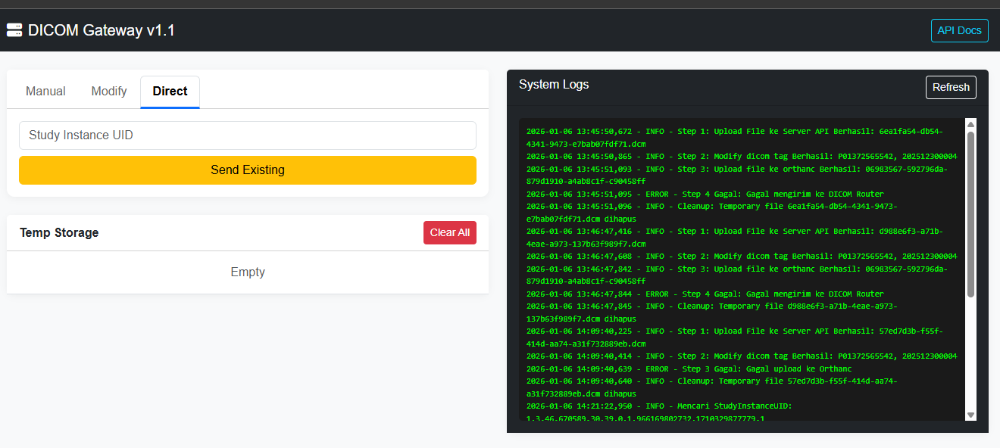
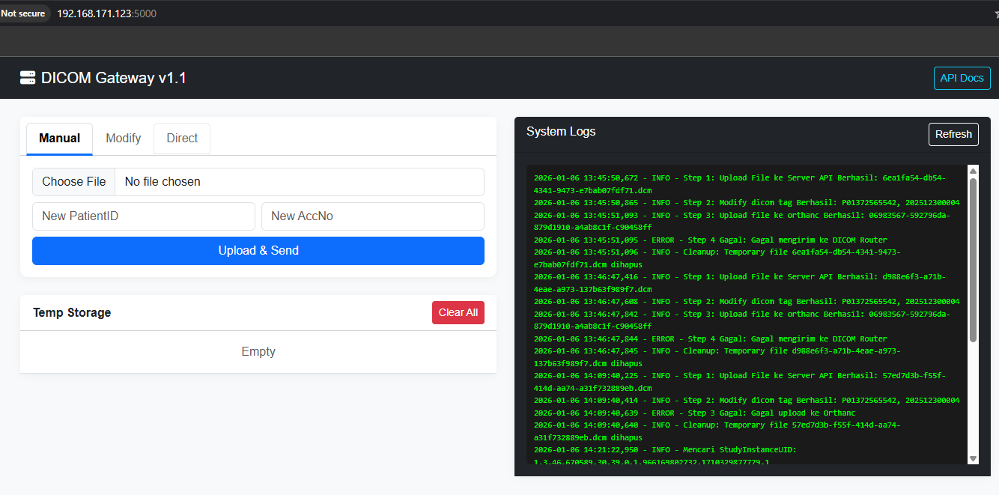
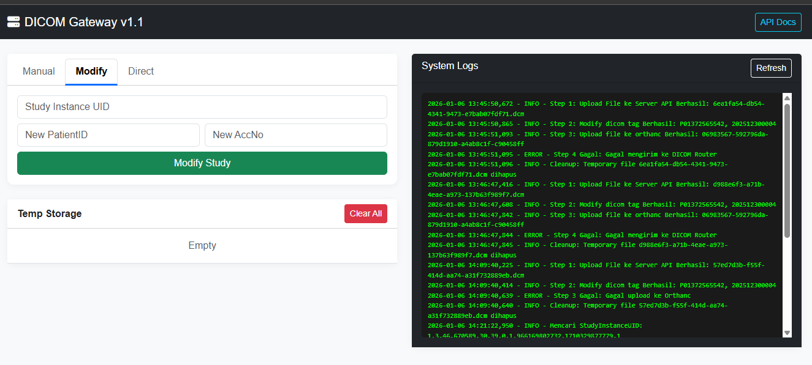

## FLASK API DICOM ROUTER GATEWAY



### 1. ORTHANC SERVER PACS, DCMTK

- DICOM ROUTER

Install dicom router mode docker

```
mkdir dicom-router 
cd dicom-router 
nano docker-compose.yml 
```
```yml
services: 
  dicom-router: 
    image: registry.dto.kemkes.go.id/pub/dicom-router:latest 
    container_name: dicom-router 
    restart: always 
    ports: 
      - "11112:11112"   # DICOM port router 
      - "8080:8080"     # Web UI router 
    environment: 
      AE_TITLE: DCMROUTER 
      ORG_ID: "10009999" 
      CLIENT: "Gzn7Yj---------------" 
      SECRET: "fbPy8S---------------" 
      WEBHOOK_URL: "https://api-satusehat.kemkes.go.id" 
      WEBHOOK_USER: "youruser" 
      WEBHOOK_PASSWORD: "yourpass" 
      URL: "https://api-satusehat.kemkes.go.id" 
    networks: 
      - dicom-network 
 
networks: 
  dicom-network: 
    driver: bridge 
```

```
docker compose up -d 
docker ps -a 
docker logs dicom-router | head -n 50 
docker logs -f dicom-router 
sudo netstat -tulpn | grep 11112 
```
PASTIKAN server dcm router berjalan
```
docker ps --filter "name=dicom-router"

CONTAINER ID   IMAGE                                               COMMAND                CREATED      STATUS      PORTS                                                                                          NAMES
3e7b0312d7d4   registry.dto.kemkes.go.id/pub/dicom-router:latest   "/app/entrypoint.sh"   2 days ago   Up 2 days   0.0.0.0:8080->8080/tcp, [::]:8080->8080/tcp, 0.0.0.0:11112->11112/tcp, [::]:11112->11112/tcp   dicom-router

```
```
docker logs -f dicom-router
```

dicom router wajib di daftarkan ke server pacs orthanc

- ORTHANC

Install orthanc server pacs >> model langsung di os bukan docker

saya menggunakan ubuntu di vm 2core 4gbram 100gb, jika ingin storege di luar os, bisa di setting  orthanc.json

```
sudo apt install orthanc orthanc-dicomweb orthanc-webviewer -y
ls /usr/share/orthanc/plugins/
sudo rm /etc/orthanc/plugins.json
sudo rm /etc/orthanc/webviewer.json
sudo rm /etc/orthanc/serve-folders.json

Melihat Study
curl -u orthanc:orthanc http://192.168.30.21:8042/studies
Uploud File
curl -u orthanc:orthanc -X POST  http://192.168.30.21:8042/instances  -H "Content-Type: application/dicom" --data-binary @0003.DCM
Kirim ke dicomrouter
curl -u orthanc:orthanc -X POST   http://192.168.30.21:8042/modalities/DCMROUTER/store   -H "Content-Type: application/json"   -d '["a5d9d99e-9e18c97b-952af9c9-9a1a3cdc-dabf01a0"]'

sudo nano /etc/orthanc/orthanc.json

contoh orthanc.json bisa dilihat di folder /images
```
```json
"DicomModalities" : {
   "DCMROUTER" : [ "DCMROUTER", "192.10.10.51", 11112 ]
}
```
```
sudo systemctl restart orthanc
sudo systemctl status orthanc

```


- DCMTK

Install DCMTK di OS
```
sudo apt update && sudo apt upgrade -y
sudo apt install dcmtk -y
which dcmdump
dcmdump --version

dcmodify -i "(0010,0020)=P02371443444"          -i "(0008,0050)=202512300001"          0003.DCM

dcmdump 0003.DCM | grep -E "PatientID|AccessionNumber"
```
- FLASK API, bisa di OS atau docker

```
mkdir flask-dicom
cd flask-dicom
sudo apt install python3-venv -y
python3 -m venv venv
source venv/bin/activate
pip install flask flask-restx requests

```

### 2. Spesifikasi API Gateway DICOM 

A. POST /api/dicom/raw-send

Endpoint ini digunakan untuk memproses file DICOM yang belum ada di server (masih di komputer lokal user).
- Deskripsi: Upload file ke gateway $\rightarrow$ Modifikasi Tag $\rightarrow$ Upload ke Orthanc $\rightarrow$ Kirim ke Router.
- Content-Type: multipart/form-dataParameter (Form Data):

| Parameter | Tipe | Wajib | Deskripsi |
| :--- | :--- | :--- | :--- |
| file | File | Ya | File biner DICOM (.dcm) |
| patientid | String | Ya | ID Pasien baru yang akan diinject |
| accesionnum | String | Ya | Accession Number baru yang akan diinject |

Respon Sukses (200 OK):
```JSON
{
  "status": "success",
  "orthanc_id": "4a0b467b-2f26e3a1-ed9ee50a-42cad11b-f8f2f90c"
}
```
B. POST /api/dicom/ort-send

Endpoint ini digunakan untuk mengambil data yang sudah ada di Orthanc, mengubah identitasnya, lalu mengirimkannya ulang.
- Deskripsi: Download dari Orthanc $\rightarrow$ Modifikasi Tag $\rightarrow$ Upload kembali $\rightarrow$ Kirim ke Router.
- Content-Type: application/json
- Body Request:
```JSON
{
  "instance_id": "4a0b467b-2f26e3a1-ed9ee50a-42cad11b-f8f2f90c",
  "patientid": "P0237144....",
  "accesionnum": "202512300001"
}
```
- Logika Internal: Gateway menggunakan dcmodify secara sementara sebelum mengunggah kembali instance yang sudah diubah ke database Orthanc.

C. POST /api/dicom/dcm-send
- Endpoint paling sederhana, hanya digunakan untuk memicu pengiriman data (routing) tanpa melakukan perubahan metadata.
- Deskripsi: Instruksi kepada Orthanc untuk mengirim Study ID tertentu ke DICOM Router (AET: DCMROUTER).
- Content-Type: application/json
- Body Request:
```JSON

{
  "study_id": "a5d9d99e-9e18c97b-952af9c9-9a1a3cdc-dabf01a0"
}
```
- Respon Sukses (200 OK):
```JSON
{
  "status": "sent to router"
}
```
- api dokumentasi : http://<#ip-flaskserver>/api/docs



- html web : http://<#ip-flaskserver>







### CLONE DAN RUNNING DI DOCKER

```
git clone https://github.com/edycoleee/flask-dicomrouter-orthan dicom-gateway

dicom-gateway/
├── app.py              # Kode Flask Anda
├── Dockerfile          # File untuk build image
├── docker-compose.yml  # File konfigurasi container
├── requirements.txt    # Daftar library python
├── templates/
│   └── dcmpage.html    # File UI
└── temp_dicom/         # Folder temporary (akan dibuat otomatis)


cd dicom-gateway
docker-compose up --build -d
docker-compose ps
docker logs -f dicom-gateway-app
```


### RESPONSE DARI DICOM ROUTER 

 Responnya sukses tidak bisa dilihat dari api dicom gateway, tapi hanya bisa dilihat dari dalam log dicom router :
```
docker logs dicom-router --tail 50
```
- RESPONSE SUKSES
```
D: ========================== INCOMING DIMSE MESSAGE ==========================
D: Message Type                  : C-STORE RQ
D: Presentation Context ID       : 63
D: Message ID                    : 1
D: Affected SOP Class UID        : Digital X-Ray Image Storage - For Presentation
D: Affected SOP Instance UID     : 1.3.46.670589.30.39.0.1.966169802732.1757423874385.1
D: Data Set                      : Present
D: Priority                      : Medium
D: ============================ END DIMSE MESSAGE =============================
I: [Info-Assoc] - handle_store
D: pydicom.read_dataset() TransferSyntax="Little Endian Implicit"
I: Directory created
I: Association Released
I: Processing DICOM start
I: Accession Number: 202512300---
I: Study IUID: 1.3.46.670589.30.39.0.1.966169802732.1757423826764.1
I: Obtaining Patient ID and ServiceRequest ID
I: Patient ID and ServiceRequest ID obtained
I: Encryption Config is False
I: Start creating ImagingStudy
I: ImagingStudy 1.3.46.670589.30.39.0.1.966169802732.1757423826764.1 created
I: POST-ing ImagingStudy
```
 ```json
{
  "basedOn": [
    {
      "reference": "ServiceRequest/ce124594---------"
    }
  ],
  "description": "Chest",
  "id": "4630e0ce-26a6-4ae5-------",
  "identifier": [
    {
      "system": "http://sys-ids.kemkes.go.id/acsn/100025702",
      "type": {
        "coding": [
          {
            "code": "ACSN",
            "system": "http://terminology.hl7.org/CodeSystem/v2-0203"
          }
        ]
      },
      "use": "usual",
      "value": "202512300---"
    },
    {
      "system": "urn:dicom:uid",
      "value": "urn:oid:1.3.46.670589.30.39.0.1.966169802732.1757423826764.1"
    }
  ],
  "meta": {
    "lastUpdated": "2026-01-07T04:45:00.073409+00:00",
    "versionId": "MTc2Nzc2MTEwMDA3MzQwOTAwMA"
  },
  "modality": [
    {
      "code": "DX",
      "system": "http://dicom.nema.org/resources/ontology/DCM"
    }
  ],
  "numberOfInstances": 1,
  "numberOfSeries": 1,
  "resourceType": "ImagingStudy",
  "series": [
    {
      "description": "Chest",
      "instance": [
        {
          "number": 1,
          "sopClass": {
            "code": "urn:oid:1.2.840.10008.5.1.4.1.1.1.1",
            "system": "urn:ietf:rfc:3986"
          },
          "title": "ORIGINAL\\PRIMARY",
          "uid": "1.3.46.670589.30.39.0.1.966169802732.1757423874385.1"
        }
      ],
      "modality": {
        "code": "DX",
        "system": "http://dicom.nema.org/resources/ontology/DCM"
      },
      "number": 1,
      "numberOfInstances": 1,
      "started": "2025-09-09T14:17:32+07:00",
      "uid": "1.3.46.670589.30.39.0.1.966169802732.1757423874364.1"
    }
  ],
  "started": "2025-09-09T14:17:30+07:00",
  "status": "available",
  "subject": {
    "reference": "Patient/P00284578---"
  }
}

 ```  
 ```
I: ImagingStudy POST-ed, id: 4630e0ce-26a6-4ae5-ab02-c66138ee1bbe
I: DICOM Push started
I: dicom_push imagingStudyID: 4630e0ce-26a6-4ae5-ab02-c66138ee1bbe
I: Sending Instance UID: 1.3.46.670589.30.39.0.1.966169802732.1757423874364.1/1.3.46.670589.30.39.0.1.966169802732.1757423874385.1 success
I: DICOM sent successfully
I: Deleting association folder

 ```

- RESPONSE ERROR

Accession number(Number) dan Patient id(Tidak Kososng) tidak sesuai format yang diperbolehkan

 ```
 D: User Identity Negotiation Response: None
D: ========================== END A-ASSOCIATE-AC PDU ==========================
D: pydicom.read_dataset() TransferSyntax="Little Endian Implicit"
I: Received Store Request
D: ========================== INCOMING DIMSE MESSAGE ==========================
D: Message Type                  : C-STORE RQ
D: Presentation Context ID       : 63
D: Message ID                    : 1
D: Affected SOP Class UID        : Digital X-Ray Image Storage - For Presentation
D: Affected SOP Instance UID     : 1.3.46.670589.30.39.0.1.966169802732.1757423874385.1
D: Data Set                      : Present
D: Priority                      : Medium
D: ============================ END DIMSE MESSAGE =============================
I: [Info-Assoc] - handle_store
D: pydicom.read_dataset() TransferSyntax="Little Endian Implicit"
I: Directory created
I: Association Released
I: Processing DICOM start
I: Accession Number:
I: Study IUID: 1.3.46.670589.30.39.0.1.966169802732.1757423826764.1
I: Obtaining Patient ID and ServiceRequest ID
I: Patient ID and ServiceRequest ID obtained
I: Encryption Config is False
I: Start creating ImagingStudy
E: 'NoneType' object has no attribute 'json'
E: Failed to create ImagingStudy for 1.3.46.670589.30.39.0.1.966169802732.1757423826764.1
I: Deleting association folder
 ```
Accession number belum di daftarkan dengan service request

 ```
D: User Identity Negotiation Response: None
D: ========================== END A-ASSOCIATE-AC PDU ==========================
D: pydicom.read_dataset() TransferSyntax="Little Endian Implicit"
I: Received Store Request
D: ========================== INCOMING DIMSE MESSAGE ==========================
D: Message Type                  : C-STORE RQ
D: Presentation Context ID       : 63
D: Message ID                    : 1
D: Affected SOP Class UID        : Digital X-Ray Image Storage - For Presentation
D: Affected SOP Instance UID     : 1.3.46.670589.30.39.0.1.966169802732.1767272497253.1
D: Data Set                      : Present
D: Priority                      : Medium
D: ============================ END DIMSE MESSAGE =============================
I: [Info-Assoc] - handle_store
D: pydicom.read_dataset() TransferSyntax="Little Endian Implicit"
I: Directory created
I: Association Released
I: Processing DICOM start
I: Accession Number: 202512300---
I: Study IUID: 1.3.46.670589.30.39.0.1.966169802732.1767272178983.1
I: Obtaining Patient ID and ServiceRequest ID
E: Failed to obtain Patient ID and ServiceRequest ID
Traceback (most recent call last):
  File "internal/dicom_handler.py", line 159, in handle_assoc_released
    serviceRequestID, patientID = satusehat.get_service_request(accession_no)
                                  ^^^^^^^^^^^^^^^^^^^^^^^^^^^^^^^^^^^^^^^^^^^
  File "interface/satusehat.py", line 28, in get_service_request
    raise Exception("ServiceRequest not found")
Exception: ServiceRequest not found
I: Encryption Config is False
I: Deleting association folder
 ```